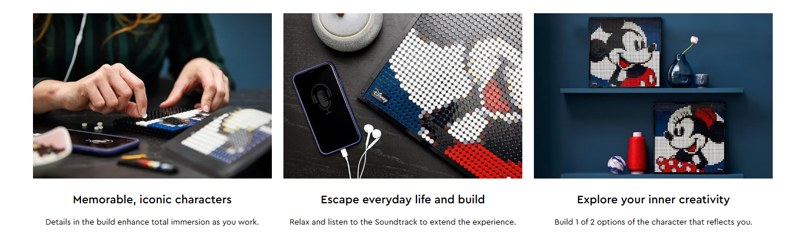
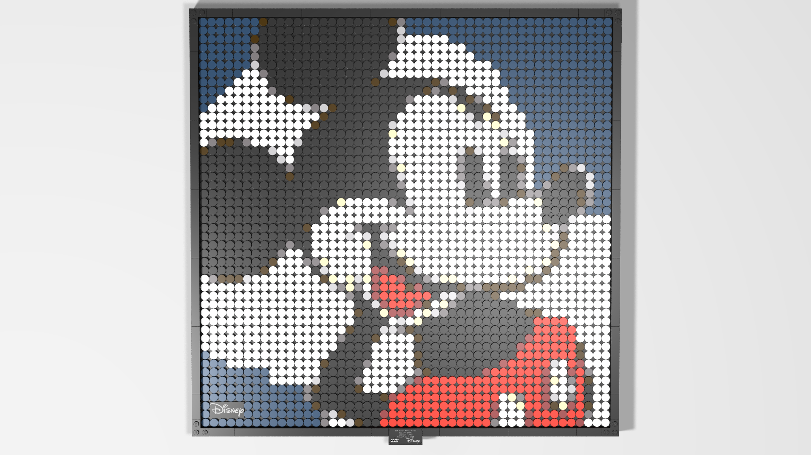

## Official LEGO® Infomation 

**Official Lego Infomation: [source](https://www.lego.com/en-gb/product/disney-s-mickey-mouse-31202)**

If you’re a fan of classic Disney characters, we have a project just for you! You can build 1 of 2 wall decor portraits with this LEGO® Art ǀ Disney’s Mickey Mouse (31202) set and enjoy a creative mosaic project that offers active stress relief as you build.

## LEGO relaxation for adults
Spend some rejuvenation time assembling a tile picture of either Disney's Mickey Mouse or Minnie Mouse with this 2,658-piece set. As you build, listen to the included Soundtrack and learn more about the iconic characters. Up for a change? Rebuild it or collect 2 sets and create a united Mickey Mouse and Minnie Mouse wall decoration.

## Creative possibilities
You don’t have to be an artist or LEGO collector to appreciate the creativity of this set. Once finished, display it on a wall or shelf in your home or office. This LEGO Art set is part of a unique collection of building kits focused on art, music, design and architecture that also make a great gift for anyone (including yourself) seeking a new project.

- Show off your love of Disney’s Mickey Mouse or Minnie Mouse with this stunning mosaic LEGO® Art ǀ Disney’s Mickey Mouse (31202) set. You can display the piece on your wall or shelf after creating it.
- Enjoy a relaxing break with this LEGO® set, featuring over 2,650 pieces, including 9 canvas wall decor plates, Disney signature tile, brick-built LEGO frame, unique hanging element and a tile tool.
- This set lets you relax and recharge while you focus on your appreciation for Disney's Mickey Mouse through art. With the included Soundtrack, you can learn new details as you build.
- To push your creativity further, combine 2 of the craft hobby sets to create a special united piece, featuring Disney’s Mickey Mouse and Minnie Mouse on a distinctive background.
- A portrait measures over 15.5 in. (40 cm) square and offers 2 building options. It makes a meaningful gift for yourself or other Disney enthusiasts in your life who also love DIY projects.
- The coffee-table-quality instructions guide you through the project and offer a stress-relieving road map through the art along with some creative LEGO®-inspired relaxation.
- Perfect to display on a wall or shelf, LEGO® Art sets offer adults like you a rewarding building experience while you explore your passion for creative arts-and-crafts-related hobbies.
- LEGO® components meet rigorous industry standards to ensure they are consistent, compatible and connect and pull apart consistently every time – it's been that way since 1958.
- LEGO® components are dropped, squashed, twisted, heated, bent, scratched and stretched, ensuring that this Disney’s Mickey Mouse wall decor piece meets stringent global safety standards.

## Version Build in Bricklink-Studio

